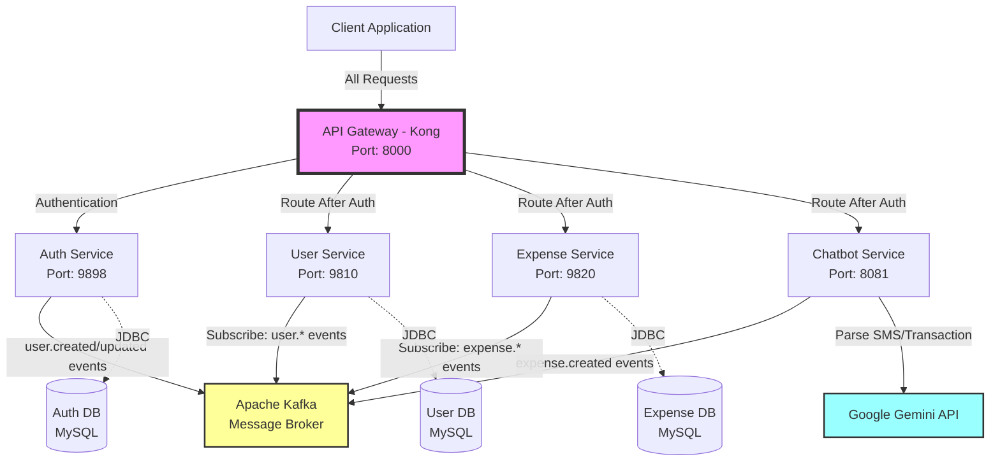
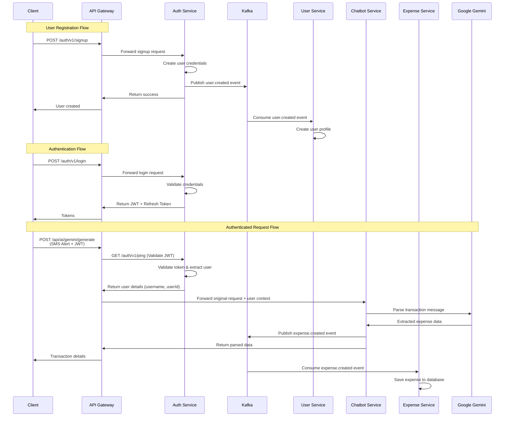
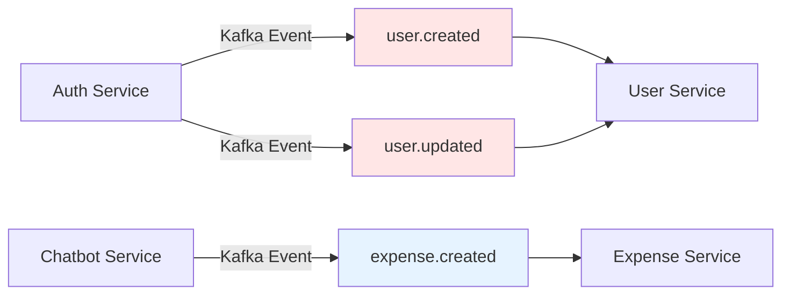

# 💰 Expense Tracker

A modern, scalable expense tracking application built with Spring Boot microservices architecture. This application leverages AI-powered transaction parsing using Google Gemini to automatically extract expense details from SMS banking alerts and transaction messages.

[](https://spring.io/projects/spring-boot)
[](https://www.oracle.com/java/)
[](https://www.docker.com/)
[](LICENSE)

---

## 📋 Table of Contents

- [Overview](#overview)
- [Architecture](#architecture)
- [Services](#services)
- [Technologies](#technologies)
- [Prerequisites](#prerequisites)
- [Getting Started](#getting-started)
- [API Documentation](#api-documentation)
- [Testing](#testing)
- [Deployment](#deployment)
- [Contributing](#contributing)
- [License](#license)

---

## 🎯 Overview

Expense Tracker is a comprehensive solution for managing personal finances through a microservices-based architecture. The system features AI-powered transaction parsing using Google Gemini, allowing users to input bank SMS alerts or transaction messages and automatically extract structured expense data.

### Key Features

- 🔐 **Secure Authentication** - JWT-based authentication with refresh token support
- 👤 **User Management** - Complete user profile and account management
- 💸 **Expense Tracking** - Create, read, update, and delete expense records
- 🤖 **AI-Powered Parsing** - Extract transaction details from SMS alerts using Google Gemini
- 🚀 **Scalable Architecture** - Independent microservices for easy horizontal scaling
- 📨 **Event-Driven Communication** - Asynchronous processing with Kafka messaging
- 🔄 **API Gateway** - Centralized routing and security with Kong Gateway
- 🐳 **Fully Dockerized** - One-command deployment with Docker Compose

---

## 🏗️ Architecture

The application follows a microservices architecture pattern with event-driven communication:



### Event-Driven Communication Flow



### Service Communication Pattern



---

## 🔧 Services

### 1. Auth Service (Port: 9898)

**Responsibility:** Authentication, Authorization, and User Credential Management

**Key Features:**
- User registration with credential creation
- JWT-based authentication
- Refresh token mechanism for session management
- Token validation for secured endpoints
- Publishes user events to Kafka for downstream services

**Endpoints:**

| Endpoint | Method | Auth Required | Description |
|----------|--------|---------------|-------------|
| `/auth/v1/signup` | POST | ❌ No | Register new user |
| `/auth/v1/login` | POST | ❌ No | User authentication |
| `/auth/v1/refreshToken` | POST | ❌ No | Refresh access token |
| `/auth/v1/ping` | GET | ✅ Yes | Token validation & user extraction (used by Kong) |

**Protected vs Public Endpoints:**
```java
// Public endpoints (no authentication required)
- /auth/v1/login
- /auth/v1/refreshToken
- /auth/v1/signup

// Protected endpoints (require JWT)
- /auth/v1/ping
```

**Kong Gateway Integration:**
The `/auth/v1/ping` endpoint serves as the authentication middleware for Kong Gateway:
1. Kong receives client request with JWT token
2. Kong forwards request to `/auth/v1/ping` to validate token
3. Auth Service validates JWT and extracts username/user details
4. If valid, Kong forwards original request to target service with user context
5. If invalid, Kong returns 401 Unauthorized to client

**Event Publishing:**
- Publishes `user.created` event to Kafka after successful signup
- Publishes `user.updated` event when user credentials are modified

**Technologies:**
- Spring Security
- JWT (JSON Web Tokens)
- BCrypt password encryption
- Spring Kafka Producer
- Spring Data JPA
- MySQL

---

### 2. User Service (Port: 9810)

**Responsibility:** User Profile Management

**Key Features:**
- User profile creation and updates via Kafka events
- User information retrieval
- Event-driven architecture for data consistency
- Listens to Auth Service events for automatic profile creation

**Endpoints:**

| Endpoint | Method | Auth Required | Description |
|----------|--------|---------------|-------------|
| `/user/v1/getUser` | GET | ✅ Yes | Retrieve user profile |
| `/user/v1/createUpdate` | POST | ✅ Yes | Create/Update user (testing only) |
| `/health` | GET | ❌ No | Service health check |

**Important Note:**
> The `/user/v1/createUpdate` endpoint is provided for testing purposes only. In production, user profiles are automatically created/updated by consuming Kafka events from the Auth Service.

**Event Consumption:**
- Consumes `user.created` events from Auth Service
- Consumes `user.updated` events for profile synchronization
- Maintains eventual consistency with Auth Service data

**Technologies:**
- Spring Boot
- Spring Kafka Consumer
- Spring Data JPA
- MySQL
- Lombok

---

### 3. Expense Service (Port: 9820)

**Responsibility:** Expense and Transaction Management

**Key Features:**
- Expense retrieval and analytics
- Event-driven expense creation via Kafka
- Transaction history management
- Listens to Chatbot Service for automatic expense creation

**Endpoints:**

| Endpoint | Method | Auth Required | Description |
|----------|--------|---------------|-------------|
| `/expense/v1/getExpense` | GET | ✅ Yes | Retrieve expenses |
| `/expense/v1/addExpense` | POST | ✅ Yes | Add expense (testing only) |
| `/expense/v1/health` | GET | ❌ No | Service health check |

**Important Note:**
> The `/expense/v1/addExpense` endpoint is provided for testing purposes only. In production, expenses are automatically created by consuming Kafka events from the Chatbot Service after AI parsing.

**Event Consumption:**
- Consumes `expense.created` events from Chatbot Service
- Processes parsed transaction data and persists to database
- Ensures data consistency through event-driven architecture

**Technologies:**
- Spring Boot
- Spring Kafka Consumer
- Spring Data JPA
- MySQL
- RESTful APIs

---

### 4. Chatbot Service (Port: 8081)

**Responsibility:** AI-Powered Transaction Parsing using Google Gemini

**Key Features:**
- Natural language processing for bank SMS alerts
- Integration with Google Gemini API
- Automatic data extraction (amount, merchant, date, currency)
- Event publishing to Expense Service
- Support for various bank SMS formats

**Endpoints:**

| Endpoint | Method | Auth Required | Description |
|----------|--------|---------------|-------------|
| `/api/ai/gemini/generate` | POST | ✅ Yes | Parse transaction message |

**Request Example:**
```json
{
  "prompt": "Alert: You've spent INR 450.00 at AMAZON.IN on 2024-06-25 14:30:22. Avl Bal: INR 12,345.67. Not you? Call 1800-XXX-XXXX."
}
```

**Response Example:**
```json
{
  "externalId": null,
  "amount": 450.00,
  "user_id": null,
  "merchant": "AMAZON.IN",
  "currency": "INR",
  "created_at": "2024-06-25T14:30:22.000+00:00"
}
```

**Event Publishing:**
- Publishes `expense.created` event to Kafka after successful parsing
- Includes all extracted transaction details in the event payload

**Supported Input Formats:**
- Bank SMS alerts
- Transaction notifications
- Payment confirmations
- Any transaction message with amount, merchant, and date information

**Technologies:**
- Spring Boot
- Google Gemini API
- Spring Kafka Producer
- REST Client
- JSON processing

---

### 5. API Gateway (Kong - Port: 8000)

**Responsibility:** Centralized Request Routing and Security

**Key Features:**
- Single entry point for all client requests
- JWT token validation via Auth Service
- Request routing to appropriate microservices
- Rate limiting and throttling
- CORS and security headers management
- Load balancing across service instances

**Authentication Flow with Kong:**
1. Client sends request to Kong Gateway (port 8000) with JWT token
2. Kong extracts JWT from `Authorization: Bearer {token}` header
3. Kong forwards token to Auth Service `/auth/v1/ping` endpoint
4. Auth Service validates JWT and returns username/user details
5. If authentication succeeds, Kong forwards original request to target service with user context
6. If authentication fails, Kong returns 401 Unauthorized to client
7. Response from target service is returned to client through Kong

**Protected Routes:**
- All routes except Auth Service public endpoints (`/auth/v1/login`, `/auth/v1/signup`, `/auth/v1/refreshToken`) require JWT token
- Kong uses `/auth/v1/ping` as authentication middleware before routing to any protected endpoint
- Public endpoints bypass the `/auth/v1/ping` validation step

---

## 🛠️ Technologies

### Core Framework
- **Spring Boot 3.x** - Application framework
- **Java 21** - Programming language
- **Spring Security** - Authentication and authorization
- **Spring Data JPA** - Database access layer
- **Spring Kafka** - Event streaming

### Database & Messaging
- **MySQL 8.0** - Relational database (Dockerized)
- **Apache Kafka** - Event streaming platform (Dockerized)

### API & Integration
- **RESTful APIs** - Inter-service communication
- **Google Gemini API** - AI-powered transaction parsing
- **JWT** - Token-based authentication
- **Kong Gateway** - API Gateway

### Development Tools
- **Maven** - Build automation and dependency management
- **Lombok** - Boilerplate code reduction
- **Git** - Version control
- **Postman** - API testing
- **IntelliJ IDEA** - IDE

### Testing
- **JUnit 5** - Unit testing framework
- **Mockito** - Mocking framework
- **Spring Boot Test** - Integration testing

### DevOps & Deployment
- **Docker** - Containerization
- **Docker Compose** - Multi-container orchestration

### Monitoring & Logging (Optional)
- **Prometheus** - Metrics collection
- **Grafana** - Metrics visualization
- **ELK Stack** (Elasticsearch, Logstash, Kibana) - Centralized logging

---

## 📦 Prerequisites

Before running the application, ensure you have the following installed:

### Required
- **Java 21** - [Download](https://www.oracle.com/java/technologies/downloads/#java21)
- **Maven 3.8+** - [Download](https://maven.apache.org/download.cgi)
- **Docker** - [Download](https://www.docker.com/products/docker-desktop)
- **Docker Compose** - (Included with Docker Desktop)

### Optional (for development)
- **IntelliJ IDEA** or your preferred IDE
- **Postman** - For API testing
- **Git** - For version control

### API Keys Required
- **Google Gemini API Key** - [Get API Key](https://makersuite.google.com/app/apikey)

**Note:** MySQL, Kafka, and Zookeeper are fully Dockerized - no separate installation needed!

---

## 🚀 Getting Started

### 1. Clone the Repository

```bash
git clone https://github.com/yourusername/expense-tracker.git
cd expense-tracker
```

### 2. Set Environment Variables

Create a `.env` file in the project root:

```bash
# JWT Configuration
JWT_SECRET=your_jwt_secret_key_min_256_bits
JWT_EXPIRATION=86400000
JWT_REFRESH_EXPIRATION=604800000

# Google Gemini API
GEMINI_API_KEY=your_gemini_api_key

# Database Configuration (handled by Docker)
MYSQL_ROOT_PASSWORD=rootpassword
MYSQL_DATABASE=expense_tracker

# Kafka Configuration (handled by Docker)
KAFKA_BOOTSTRAP_SERVERS=kafka:9092
```

### 3. Build All Services

```bash
# Build all services using Maven
mvn clean install
```

This will:
- Compile all microservices
- Run unit tests
- Package each service as a JAR file

### 4. Start the Application with Docker Compose

```bash
# Start all services (databases, Kafka, microservices)
docker-compose up -d

# View logs
docker-compose logs -f

# View logs for specific service
docker-compose logs -f auth-service
```

### 5. Verify Services are Running

Check the health of each service:

```bash
# Auth Service
curl http://localhost:9898/auth/v1/ping

# User Service
curl http://localhost:9810/health

# Expense Service
curl http://localhost:9820/expense/v1/health

# Chatbot Service
curl http://localhost:8081/actuator/health
```

### 6. Access the Application

- **API Gateway:** http://localhost:8000
- **Auth Service:** http://localhost:9898
- **User Service:** http://localhost:9810
- **Expense Service:** http://localhost:9820
- **Chatbot Service:** http://localhost:8081

---

## 🐳 Docker Compose Architecture

The `docker-compose.yml` includes:

```yaml
services:
  # Infrastructure
  - mysql (Port: 3306)
  - zookeeper (Port: 2181)
  - kafka (Port: 9092)
  - kong-database (PostgreSQL for Kong)
  - kong-gateway (Port: 8000)
  
  # Microservices
  - auth-service (Port: 9898)
  - user-service (Port: 9810)
  - expense-service (Port: 9820)
  - chatbot-service (Port: 8081)
```

### Useful Docker Commands

```bash
# Start all services
docker-compose up -d

# Stop all services
docker-compose down

# Restart specific service
docker-compose restart auth-service

# View service logs
docker-compose logs -f service-name

# Rebuild and restart services
docker-compose up -d --build

# Remove all containers and volumes
docker-compose down -v
```

---

## 📖 API Documentation

### Authentication APIs

#### 1. User Signup
```http
POST http://localhost:8000/auth/v1/signup
Content-Type: application/json

{
  "username": "john_doe",
  "email": "john@example.com",
  "password": "SecurePass123!",
  "firstName": "John",
  "lastName": "Doe"
}

Response (201 Created):
{
  "message": "User registered successfully",
  "userId": "uuid-generated-id"
}
```

#### 2. User Login
```http
POST http://localhost:8000/auth/v1/login
Content-Type: application/json

{
  "email": "john@example.com",
  "password": "SecurePass123!"
}

Response (200 OK):
{
  "accessToken": "eyJhbGciOiJIUzI1NiIsInR5cCI6IkpXVCJ9...",
  "refreshToken": "eyJhbGciOiJIUzI1NiIsInR5cCI6IkpXVCJ9...",
  "tokenType": "Bearer",
  "expiresIn": 86400000
}
```

#### 3. Refresh Token
```http
POST http://localhost:8000/auth/v1/refreshToken
Content-Type: application/json

{
  "refreshToken": "eyJhbGciOiJIUzI1NiIsInR5cCI6IkpXVCJ9..."
}

Response (200 OK):
{
  "accessToken": "eyJhbGciOiJIUzI1NiIsInR5cCI6IkpXVCJ9...",
  "tokenType": "Bearer",
  "expiresIn": 86400000
}
```

#### 4. Ping - Token Validation (Used by Kong Gateway)
```http
GET http://localhost:8000/auth/v1/ping
Authorization: Bearer {accessToken}

Response (200 OK):
{
  "username": "john_doe",
  "userId": "uuid-generated-id",
  "email": "john@example.com",
  "valid": true
}

Response (401 Unauthorized - Invalid Token):
{
  "error": "Unauthorized",
  "message": "Invalid or expired token"
}
```

**Note:** This endpoint is primarily used by Kong Gateway for authentication middleware. It validates the JWT token and extracts user information, which Kong then uses to route authenticated requests to the appropriate microservices.

---

### User Management APIs

#### 1. Get User Profile
```http
GET http://localhost:8000/user/v1/getUser
Authorization: Bearer {accessToken}

Response (200 OK):
{
  "userId": "uuid-generated-id",
  "username": "john_doe",
  "email": "john@example.com",
  "firstName": "John",
  "lastName": "Doe",
  "createdAt": "2025-10-01T10:30:00Z",
  "updatedAt": "2025-10-05T14:20:00Z"
}
```

#### 2. Create/Update User (Testing Only)
```http
POST http://localhost:8000/user/v1/createUpdate
Authorization: Bearer {accessToken}
Content-Type: application/json

{
  "userId": "uuid-generated-id",
  "firstName": "John",
  "lastName": "Doe",
  "phoneNumber": "+1234567890"
}

Response (200 OK):
{
  "message": "User profile updated successfully",
  "userId": "uuid-generated-id"
}
```

---

### Expense Management APIs

#### 1. Get Expenses
```http
GET http://localhost:8000/expense/v1/getExpense
Authorization: Bearer {accessToken}

Query Parameters (optional):
- startDate: 2025-10-01
- endDate: 2025-10-31
- category: Groceries
- minAmount: 100
- maxAmount: 1000

Response (200 OK):
[
  {
    "expenseId": "uuid-expense-id",
    "userId": "uuid-user-id",
    "amount": 450.00,
    "currency": "INR",
    "merchant": "AMAZON.IN",
    "category": "Shopping",
    "createdAt": "2024-06-25T14:30:22Z",
    "description": "Online shopping"
  }
]
```

#### 2. Add Expense (Testing Only)
```http
POST http://localhost:8000/expense/v1/addExpense
Authorization: Bearer {accessToken}
Content-Type: application/json

{
  "amount": 450.00,
  "currency": "INR",
  "merchant": "AMAZON.IN",
  "category": "Shopping",
  "description": "Online shopping",
  "transactionDate": "2024-06-25T14:30:22Z"
}

Response (201 Created):
{
  "expenseId": "uuid-expense-id",
  "message": "Expense added successfully"
}
```

---

### AI Transaction Parsing API

#### Parse Bank SMS Alert
```http
POST http://localhost:8000/api/ai/gemini/generate
Authorization: Bearer {accessToken}
Content-Type: application/json

{
  "prompt": "Alert: You've spent INR 450.00 at AMAZON.IN on 2024-06-25 14:30:22. Avl Bal: INR 12,345.67. Not you? Call 1800-XXX-XXXX."
}

Response (200 OK):
{
  "externalId": null,
  "amount": 450.00,
  "user_id": null,
  "merchant": "AMAZON.IN",
  "currency": "INR",
  "created_at": "2024-06-25T14:30:22.000+00:00"
}
```

**Supported SMS Formats:**
- Standard bank transaction alerts
- UPI payment notifications
- Credit/Debit card transaction alerts
- E-wallet payment confirmations

**Example SMS Formats:**
```
1. "Your A/C XX1234 debited with Rs.1,250.00 on 25-Oct-25 at SWIGGY. Avl Bal: Rs.15,000.00"

2. "Rs 850 debited from A/c **5678 on 25Oct25 for UPI/PayTM Payments/xyz@paytm"

3. "Alert: INR 2,500.00 spent at ZOMATO on 25-10-2025 17:45:30. Available Balance: INR 25,000.00"

4. "Your card ending 9012 used for Rs 1,890.00 at AMAZON on 25/10/25. Not you? Call us"
```

---

## 🧪 Testing

### Run Unit Tests

```bash
# Test all services
mvn test

# Test specific service
cd auth-service && mvn test
cd user-service && mvn test
cd expense-service && mvn test
cd chatbot-service && mvn test
```

### Run Integration Tests

```bash
mvn verify -P integration-tests
```

### Manual Testing with Postman

1. Import the Postman collection (if provided)
2. Set environment variables:
    - `BASE_URL`: http://localhost:8000
    - `AUTH_TOKEN`: (obtained from login)

**Testing Workflow:**
1. **Signup** → Create a new user
2. **Login** → Get JWT token
3. **Get User** → Verify user profile created (via Kafka)
4. **Parse SMS** → Submit bank SMS alert
5. **Get Expenses** → Verify expense created (via Kafka)

### Testing Event-Driven Features

#### Test User Creation via Kafka
```bash
# 1. Signup user via Auth Service
curl -X POST http://localhost:8000/auth/v1/signup \
  -H "Content-Type: application/json" \
  -d '{
    "username": "testuser",
    "email": "test@example.com",
    "password": "Test123!"
  }'

# 2. Login to get token
TOKEN=$(curl -X POST http://localhost:8000/auth/v1/login \
  -H "Content-Type: application/json" \
  -d '{
    "email": "test@example.com",
    "password": "Test123!"
  }' | jq -r '.accessToken')

# 3. Verify user profile created in User Service
curl http://localhost:8000/user/v1/getUser \
  -H "Authorization: Bearer $TOKEN"
```

#### Test Expense Creation via Kafka
```bash
# 1. Parse SMS alert via Chatbot Service
curl -X POST http://localhost:8000/api/ai/gemini/generate \
  -H "Authorization: Bearer $TOKEN" \
  -H "Content-Type: application/json" \
  -d '{
    "prompt": "Alert: You spent INR 500.00 at STARBUCKS on 2025-10-07 09:30:00"
  }'

# 2. Wait 2-3 seconds for Kafka processing

# 3. Verify expense created in Expense Service
curl http://localhost:8000/expense/v1/getExpense \
  -H "Authorization: Bearer $TOKEN"
```

---

## 🔒 Security

### Authentication Flow
1. User credentials are validated by Auth Service
2. JWT access token (24 hours) and refresh token (7 days) are issued
3. All subsequent requests must include `Authorization: Bearer {token}` header
4. Kong Gateway validates token by calling Auth Service `/auth/v1/ping` endpoint
5. Auth Service validates JWT and returns user details (username, userId, email)
6. Kong forwards the original request to target service with user context
7. If token is invalid or expired, Kong returns 401 Unauthorized

### Token Validation Process (Kong → Auth Service)
```
Client Request → Kong Gateway → Auth Service (/auth/v1/ping)
                                      ↓
                               Validate JWT & Extract User
                                      ↓
                        Return: {username, userId, email, valid: true}
                                      ↓
Kong → Forward to Target Service with User Context
```

### Password Security
- Passwords are hashed using BCrypt with salt
- Minimum password requirements enforced
- No plain text password storage

### API Security
- CORS enabled with configurable origins
- CSRF protection on state-changing operations
- Rate limiting via Kong Gateway
- SQL injection prevention via JPA

---

## 📊 Monitoring and Logging

### Health Checks

Each service exposes health endpoints:

```bash
# User Service
curl http://localhost:9810/health

# Expense Service
curl http://localhost:9820/expense/v1/health

# Chatbot Service (Spring Actuator)
curl http://localhost:8081/actuator/health
```

**Note:** The Auth Service `/auth/v1/ping` endpoint is not a health check - it's used by Kong Gateway for token validation and user authentication. For Auth Service health monitoring, consider adding a dedicated health endpoint or use Spring Actuator.

### Docker Container Logs

```bash
# View all logs
docker-compose logs -f

# View specific service logs
docker-compose logs -f auth-service
docker-compose logs -f kafka

# View last 100 lines
docker-compose logs --tail=100 chatbot-service
```

### Kafka Monitoring

```bash
# List Kafka topics
docker exec -it expense-tracker-kafka kafka-topics.sh \
  --list --bootstrap-server localhost:9092

# Describe a topic
docker exec -it expense-tracker-kafka kafka-topics.sh \
  --describe --topic user-events --bootstrap-server localhost:9092

# Consume messages from a topic (for debugging)
docker exec -it expense-tracker-kafka kafka-console-consumer.sh \
  --bootstrap-server localhost:9092 \
  --topic expense-events \
  --from-beginning
```

---

## 🛠️ Troubleshooting

### Common Issues

#### 1. Services Not Starting
```bash
# Check Docker containers status
docker-compose ps

# Check specific service logs
docker-compose logs service-name

# Restart services
docker-compose restart
```

#### 2. Database Connection Issues
```bash
# Verify MySQL is running
docker-compose ps mysql

# Check MySQL logs
docker-compose logs mysql

# Connect to MySQL directly
docker exec -it expense-tracker-mysql mysql -uroot -p
```

#### 3. Kafka Connection Issues
```bash
# Verify Kafka and Zookeeper are running
docker-compose ps zookeeper kafka

# Check Kafka logs
docker-compose logs kafka

# Restart Kafka services
docker-compose restart zookeeper kafka
```

#### 4. Port Already in Use
```bash
# Find process using port (example: 9898)
lsof -i :9898

# Kill the process
kill -9 <PID>

# Or change port in docker-compose.yml
```

#### 5. JWT Token Expired
- Request new token using `/auth/v1/refreshToken` endpoint
- Or login again to get new tokens

---

## 🚀 Deployment

### Production Considerations

#### Environment Variables
Create production `.env` file with secure values:
```bash
JWT_SECRET=<strong-256-bit-secret>
GEMINI_API_KEY=<production-api-key>
MYSQL_ROOT_PASSWORD=<strong-password>
KAFKA_BOOTSTRAP_SERVERS=kafka:9092
```

#### Docker Compose for Production
```bash
# Build and start in detached mode
docker-compose -f docker-compose.prod.yml up -d

# Use production configuration
# Include resource limits and health checks
```

#### Database Backup
```bash
# Backup MySQL database
docker exec expense-tracker-mysql mysqldump -u root -p expense_tracker > backup.sql

# Restore database
docker exec -i expense-tracker-mysql mysql -u root -p expense_tracker < backup.sql
```

#### Scaling Services
```bash
# Scale specific service to multiple instances
docker-compose up -d --scale expense-service=3

# Kong Gateway will load balance across instances
```

---

## 🤝 Contributing

Contributions are welcome! Please follow these steps:

1. Fork the repository
2. Create a feature branch (`git checkout -b feature/amazing-feature`)
3. Commit your changes (`git commit -m 'Add some amazing feature'`)
4. Push to the branch (`git push origin feature/amazing-feature`)
5. Open a Pull Request

### Code Style Guidelines
- Follow Java coding conventions
- Use meaningful variable and method names
- Write JavaDoc for public methods
- Maintain test coverage above 80%
- Follow RESTful API design principles

### Commit Message Format
```
<type>(<scope>): <subject>

Examples:
feat(auth): add refresh token support
fix(expense): resolve date parsing issue
docs(readme): update API documentation
```

---


## 🙏 Acknowledgments

- Spring Boot and Spring Framework community
- Google Gemini AI for transaction parsing capabilities
- Apache Kafka for reliable event streaming
- Kong for robust API Gateway solution
- Docker for simplified deployment
- All contributors and supporters

---

## 🗺️ Roadmap

### Phase 1 (Current)
- [x] Core microservices architecture
- [x] JWT authentication
- [x] AI-powered SMS parsing
- [x] Event-driven communication
- [x] Docker deployment
